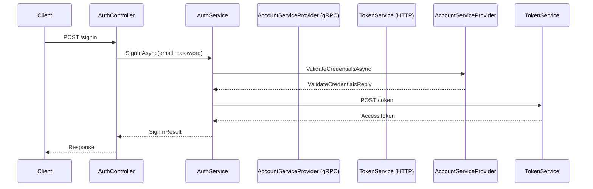

# AuthServiceProvider

Ett ASP.NET Core Web API som hanterar autentisering via gRPC och token-baserad inloggning.

## Arkitektur

- **gRPC Client:** Anropar `AccountServiceProvider` för kontohantering.
- **TokenGenerator:** Använder en extern token-provider via HTTP.
- **Controller:** `AuthController.cs` exponerar REST-endpoints.
- **Tjänst:** `AuthService.cs` innehåller inloggning och registrering.

## Sekvensdiagram – Inloggning



## Projektstruktur

```
Presentation/
├── Controllers/
├── Models/
├── Services/
├── Protos/
└── Program.cs
```

## Tester

Testprojektet ligger i `Tests/` och använder:
- `xUnit`
- `Moq`
- `Grpc.Core`
- `HttpClient` mocking

### Testfall
- ✔️ Lyckad inloggning & token
- ❌ Token misslyckas
- ❌ Ogiltiga användaruppgifter

## Kom igång

```bash
dotnet restore
dotnet build
dotnet test
```

## 🔗 Relaterat

- [AccountServiceProvider (gRPC Server)](../AccountServiceProvider)
